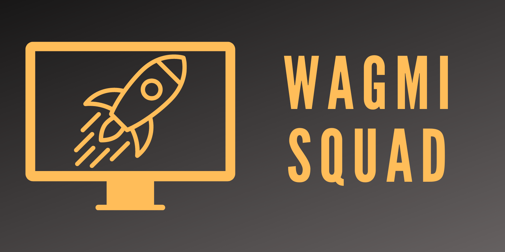

<div id="top"></div>
<!-- PROJECT SHIELDS -->
[![Contributors][contributors-shield]][contributors-url]
[![Issues][issues-shield]][issues-url]

<!-- PROJECT LOGO -->
<br />
<div align="center">
  <a href="https://github.com/msbivens/wagmi-squad-website">
    
  </a>

<h3 align="center">WAGMI Squad Website</h3>

  <p align="center">
    This website provides the relevant information for WAGMI Squad, such as information about the DAO and its members, as well as completed projects.
    <br />
    <a href="https://github.com/msbivens/wagmi-squad-website"><strong>Explore the docs »</strong></a>
    <br />
    <br />
  </p>
</div>

<!-- TABLE OF CONTENTS -->
<details>
  <summary>Table of Contents</summary>
  <ol>
    <li>
      <a href="#about-the-project">About The Project</a>
      <ul>
        <li><a href="#built-with">Built With</a></li>
      </ul>
    </li>
    <li>
      <a href="#getting-started">Getting Started</a>
      <ul>
        <li><a href="#prerequisites">Prerequisites</a></li>
        <li><a href="#installation">Installation</a></li>
      </ul>
    </li>
    <li><a href="#roadmap">Roadmap</a></li>
    <li><a href="#contributing">Contributing</a></li>
      <ul>
        <li><a href="#adding-an-active-member-profile">Adding an Active Member Profile</a></li>
        <li><a href="#updating-an-active-member-profile">Updating an Active Member Profile</a></li>
        <li><a href="#retiring-a-member-profile">Retiring a Member Profile</a></li>
        <li><a href="#adding-a-project">Adding a Project</a></li>
      </ul>
    <li><a href="#license">License</a></li>
    <li><a href="#contact">Contact</a></li>
    <li><a href="#acknowledgments">Acknowledgments</a></li>
  </ol>
</details>

<!-- ABOUT THE PROJECT -->

## About The Project


<p align="right">(<a href="#top">back to top</a>)</p>

### Built With

- [Next.js](https://nextjs.org/)
- [Tailwind CSS](https://tailwindcss.com/)

<p align="right">(<a href="#top">back to top</a>)</p>

<!-- GETTING STARTED -->

## Getting Started

To get a local copy up and running follow these simple example steps.

### Prerequisites

You will need npm or yarn to run this project locally.

- npm
  ```sh
  npm install npm@latest -g
  ```

### Installation

1. Clone the repo
   ```sh
   git clone https://github.com/msbivens/wagmi-squad-website.git
   ```
2. Install NPM packages
   ```sh
   npm install
   ```
3. Run locally
   ```
   npm run dev
   ```

<p align="right">(<a href="#top">back to top</a>)</p>

<!-- ROADMAP -->

## Roadmap

- [ ] On-board all members from squad
- [ ] Build blockend
  - [ ] Wallet access for DAO members
  - [ ] Proposal & Voting Platform

See the [open issues](https://github.com/msbivens/wagmi-squad-website/issues) for a full list of proposed features (and known issues).

<p align="right">(<a href="#top">back to top</a>)</p>

<!-- CONTRIBUTING -->

## Contributing

Contributions are what make the open source community such an amazing place to learn, inspire, and create. Any contributions you make are **greatly appreciated**.

If you have a suggestion that would make this better, please fork the repo and create a pull request. You can also simply open an issue with the tag "enhancement".

1. Fork the Project
2. Create your Feature Branch (`git checkout -b feature/AmazingFeature`)
3. Commit your Changes (`git commit -m 'Add some AmazingFeature'`)
4. Push to the Branch (`git push origin feature/AmazingFeature`)
5. Open a Pull Request

Members can make a pull request to update their profiles or add a project but must adhere to the following guidelines:

### Adding an Active Member Profile

1. Navigate to wagmi-frontend > public > members
2. Add the new members pfp as FirstLast.png, profile images should be 500 x 500px
3. Navigate to wagmi-frontend > pages > members.jsx
4. Make a new "MembersItem"
5. Fill in the information for the new member's name, imported image, and links (members are not required to have any or all)
6. Make your Pull Request

### Updating an Active Member Profile

1. Navigate to wagmi-frontend > pages > members.jsx
2. Find the correct "MembersItem"
3. Update the relevant information for the member
4. Make your Pull Request

### Retiring a Member Profile

1. Navigate to wagmi-frontend > pages > members.jsx
2. Find the correct "MembersItem"
3. Move the "MembersItem" to the retired section
4. Make a Pull Request

### Adding a Project

1. Navigate to wagmi-frontend > public > projects
2. Add thew projects image as title.png, images should be 1600x1200
3. Navigate to wagmi-frontend > components > Projects.jsx
4. Make a new "ProjectItem"
5. Fill in the information for the new project's title, imported image, and link (link is preferable medium blog writeup, otherwise it should be the github repo)
6. Make your Pull Request

<p align="right">(<a href="#top">back to top</a>)</p>

<!-- LICENSE -->

## License

Distributed under the MIT License. See `LICENSE.txt` for more information.

<p align="right">(<a href="#top">back to top</a>)</p>

<!-- CONTACT -->

## Contact

Project Link: [https://github.com/msbivens/wagmi-squad-website](https://github.com/msbivens/wagmi-squad-website)

<p align="right">(<a href="#top">back to top</a>)</p>

<!-- ACKNOWLEDGMENTS -->

## Acknowledgments

- [React Icons](https://react-icons.github.io/react-icons/)

<p align="right">(<a href="#top">back to top</a>)</p>

<!-- MARKDOWN LINKS & IMAGES -->
<!-- https://www.markdownguide.org/basic-syntax/#reference-style-links -->

[contributors-shield]: https://img.shields.io/github/contributors/msbivens/wagmi-squad-website.svg?style=for-the-badge
[contributors-url]: https://github.com/msbivens/wagmi-squad-website/graphs/contributors
[issues-shield]: https://img.shields.io/github/issues/msbivens/wagmi-squad-website.svg?style=for-the-badge
[issues-url]: https://github.com/msbivens/wagmi-squad-website/issues
